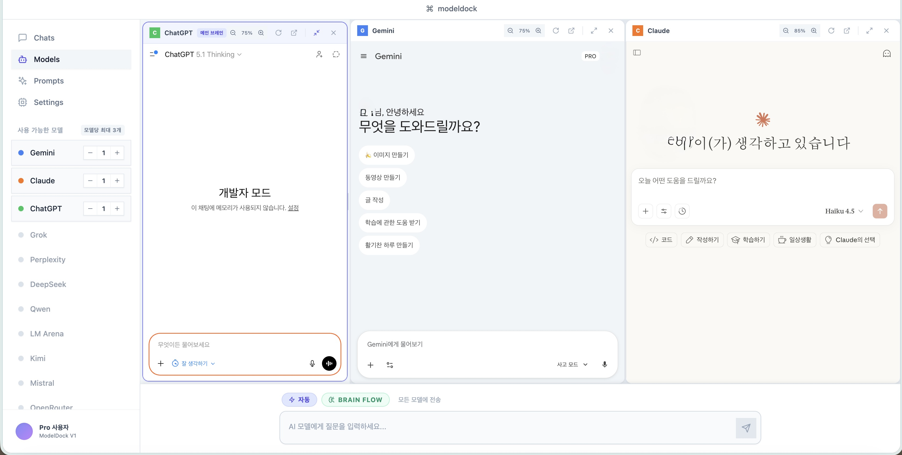
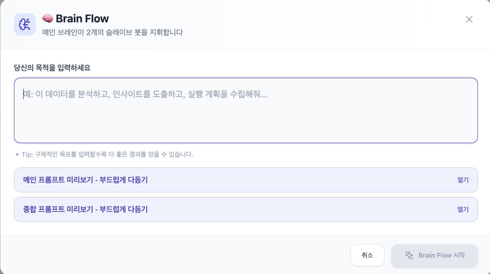
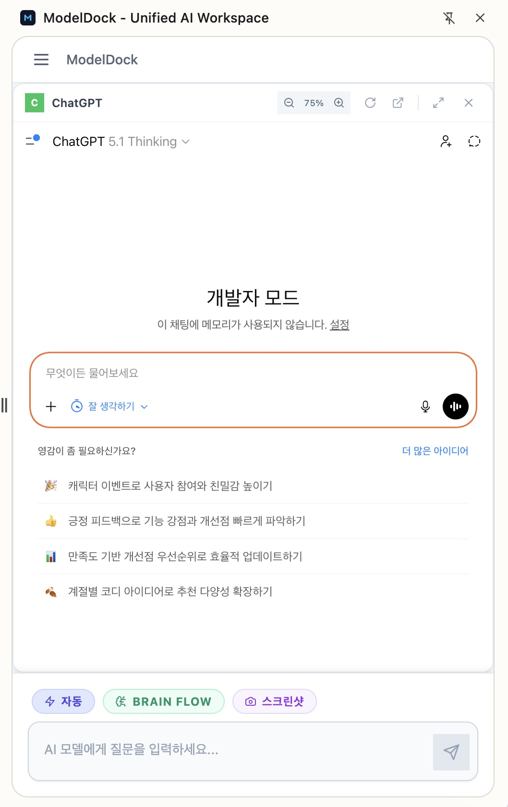
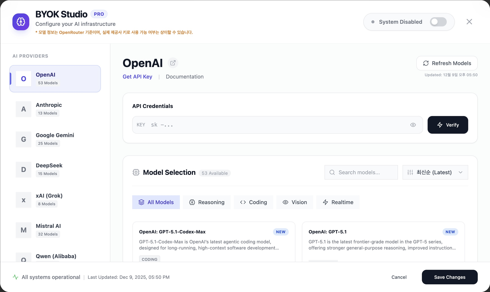
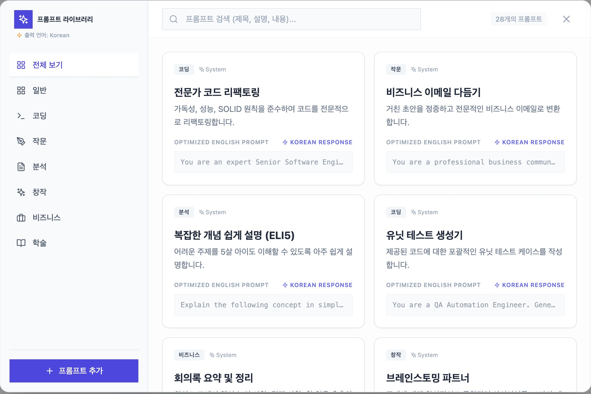

# 🚀 ModelDock Studio
## エンタープライズグレード マルチAI統合プラットフォーム

<div align="center">
  
[](https://reactjs.org/)
[](https://www.typescriptlang.org/)
[](https://vitejs.dev/)
[](https://workers.cloudflare.com/)
[](https://developer.chrome.com/docs/extensions/)
[](LICENSE)

**「一つの画面で、すべてのAIを制御」**

[한국어](./README.md) | [English](./README.en.md) | [中文](./README.zh.md)

</div>

---

## 📑 目次

- [概要](#-概要)
- [主要機能](#-主要機能)
- [システムアーキテクチャ](#-システムアーキテクチャ)
- [技術スタック](#-技術スタック)
- [スクリーンショット](#-スクリーンショット)
- [BYOKシステム](#-byokシステム)
- [セキュリティとプライバシー](#-セキュリティとプライバシー)
- [インストールとビルド](#-インストールとビルド)
- [プロジェクト構造](#-プロジェクト構造)

---

## 🎯 概要

**ModelDock Studio**は、11以上の主要AIモデルを単一のインターフェースから同時に使用できる次世代Chrome拡張機能です。エンタープライズグレードのアーキテクチャと個人ユーザーの利便性を両立したハイブリッドAIワークスペースです。

### コアバリュープロポジション

- **🔀 ハイブリッドルーティング**: iframeウェブアプリ + API（BYOK）のデュアルモード対応
- **🧠 BrainFlow**: AIモデル間の協働による高度推論エンジン
- **🔐 ゼロサーバーアーキテクチャ**: すべてのデータはローカル保存（chrome.storage.local）
- **⚡ リアルタイム同期**: セッションCookie自動ミラーリングによる完璧なログイン状態維持
- **🌐 多言語対応**: 14言語完全翻訳（i18next）

### 対応AIプロバイダー（2025年12月時点）

**動的モデルリスト管理システム**

ModelDock Studioは**デュアルハイブリッドモデルローディング方式**を採用し、常に最新のモデルを提供します：

1. **Cloudflare Workerプロキシキャッシング**（レイヤー1）
   - OpenRouter APIを通じて200+モデルメタデータをリアルタイム同期
   - R2ストレージベースの6時間キャッシング（TTL）
   - プロバイダー別自動分類と人気順ソート

2. **ユーザーAPIキーによる直接照会**（レイヤー2）
   - ユーザーがAPIキーを入力した際
   - 各プロバイダーの`/models`エンドポイントへ直接リクエスト
   - アカウント別利用可能モデルリストをリアルタイム取得

```typescript
// デュアルハイブリッドローディングフロー
User enters API Key
      ↓
1. Fetch from Cloudflare Worker Proxy (6h cache)
      ↓
2. Direct call to Provider's /models endpoint
      ↓
Merge & Display latest available models
```

| プロバイダー | iframe | API(BYOK) | 動的ローディング | モデル例 |
|------------|--------|-----------|----------------|----------|
| **OpenAI** | ✅ | ✅ | ✅ `/v1/models` | GPT-4o, o1, o3-mini |
| **Anthropic** | ✅ | ✅ | ✅ `/v1/models` | Claude 3.5 Sonnet, Opus |
| **Google** | ✅ | ✅ | ✅ `/v1beta/models` | Gemini 2.0 Flash, Pro |
| **DeepSeek** | ✅ | ✅ | ✅ `/v1/models` | R1, V3 |
| **xAI** | ✅ | ✅ | ✅ `/v1/models` | Grok 2, Vision |
| **Mistral** | ✅ | ✅ | ✅ `/v1/models` | Large 2, Codestral |
| **Qwen** | ✅ | ✅ | ✅ `/compatible-mode/v1/models` | QwQ-32B, Turbo |
| **Kimi** | ✅ | ✅ | ✅ `/v1/models` | Moonshot v1 |
| **Perplexity** | ✅ | ✅ | ✅ `/models` | Sonar Pro |
| **OpenRouter** | ✅ | ✅ | ✅ `/api/v1/models` | 200+ 統合ルーター |
| **LM Arena** | ✅ | - | - | ブラインドテスト専用 |

> **💡 主要差別化要因**: 静的ハードコーディングではなく**リアルタイムAPIベースのモデルリスト更新**—新モデルリリース直後に使用可能

---

## 🎨 主要機能

### 1️⃣ マルチモデルグリッドシステム



**同時実行アーキテクチャ**
- **無制限同時運用**: モデルごとに最大3インスタンス（19標準モデル × 3 = 最大57同時実行可能）
- 各モデルは独立したiframeサンドボックスで実行
- リアルタイムステータス監視（idle/sending/success/error）
- レスポンシブグリッドレイアウト（画面サイズに応じて自動調整、最小320px/モデル）
- ドラッグ&ドロップリサイズ対応

**ハイブリッドルーティングモード**
```typescript
// 手動モード（デフォルト）- 100%安全
User → [コピー/ペースト] → 各モデル

// 自動ルーティングモード（オプション）- 生産性最大化
User → Auto-Router → DOM注入 → すべてのモデル
                   ↓
              Content Script (content.js)
                   ↓
              モデル別セレクター
```

### 2️⃣ BrainFlow™ 協働推論エンジン



**3段階Chain-of-Thoughtプロセス**

```typescript
// フェーズ1: 戦略策定（Main Brain）
Goal → Main Brain → [SLAVE:grok-1] "市場調査"
                 → [SLAVE:claude-1] "リスク分析"
                 → [SLAVE:gemini-1] "技術検証"

// フェーズ2: 並列実行（Slaves）
[Promise.all] → すべてのスレーブを同時実行 → 結果収集

// フェーズ3: 統合（Main Brain）
収集された回答 → Main Brain → 最終レポート生成
```

### 3️⃣ サイドパネルモード



**Chrome Side Panel API活用**
- すべてのウェブページ上にオーバーレイ可能
- 独立した状態管理（`sp_`プレフィックスストレージ）
- レスポンシブUI（300px〜600px自動調整）
- メインアプリと完全に分離された履歴

### 4️⃣ BYOK（Bring Your Own Key）システム



**多型アダプターパターン**
```typescript
interface BYOKAdapter {
  validateKey(apiKey: string): Promise<boolean>;
  fetchModels(apiKey: string): Promise<BYOKModelVariant[]>;
  callAPI(params: APICallParams): Promise<APIResponse>;
}

// プロバイダー別実装
class OpenAIAdapter extends AbstractBYOKAdapter { ... }
class AnthropicAdapter extends AbstractBYOKAdapter { ... }
class GoogleAdapter extends AbstractBYOKAdapter { ... }
```

**3段階キー検証戦略**
1. `/models`エンドポイント照会（最も安価）
2. `fetchModels()`呼び出し（メタデータ豊富）
3. 超軽量completion リクエスト（maxTokens=1）

### 5️⃣ プロンプトライブラリ



**IndexedDBベース無制限ストレージ**
- カテゴリー別分類（コーディング、ライティング、分析など）
- ワンタッチ注入（すべてのモデルに注入）
- テンプレート変数サポート（`{{variable}}`）
- インポート/エクスポート（JSON）

---

## 🛠️ 技術スタック

### フロントエンド
- **React 18.2** - 関数型コンポーネント + Hooks
- **TypeScript 5.4** - 完全な型安全性
- **Vite 5.1** - 超高速HMRビルド
- **TailwindCSS 3.4** - ユーティリティファーストスタイリング
- **i18next** - 14言語国際化

### Chrome Extension APIs
- **Manifest V3** - 最新拡張機能標準
- **chrome.storage.local** - 永続データストレージ
- **chrome.cookies** - セッション同期
- **chrome.sidePanel** - サイドパネルモード

### バックエンド（サーバーレス）
- **Cloudflare Workers** - エッジコンピューティング
- **R2 Object Storage** - モデルメタデータキャッシング

---

## 🔒 セキュリティとプライバシー

### 設計原則

1. **ゼロサーバーアーキテクチャ**
   - すべてのデータはローカル保存
   - 中央サーバーなし（Cloudflare Workerはメタデータのみキャッシング）

2. **APIキー保護**
   - chrome.storage.local活用（OS レベル暗号化）
   - ネットワーク送信時はHTTPSのみ使用
   - 絶対にログ記録しない

3. **サンドボックス分離**
   - 各モデルは独立したiframeで実行
   - Content Scriptは制限された権限のみ保持

---

## 🚀 インストールとビルド

### 前提条件
- **Node.js** 18.0以上
- **npm** または **yarn**
- **Chrome** ブラウザ（Manifest V3対応）

### ローカル開発環境構築

```bash
# 1. リポジトリクローン
git clone https://github.com/dj20014920/modeldock_studio.git
cd modeldock_studio

# 2. 依存関係インストール
npm install

# 3. 開発モード実行（HMR対応）
npm run dev

# 4. プロダクションビルド
npm run build

# 5. Chromeに読み込み
# chrome://extensions/ → デベロッパーモード有効化 → 「パッケージ化されていない拡張機能を読み込む」→ distフォルダを選択
```

---

## 📂 プロジェクト構造

```
modeldock_studio/
├── public/                          # 静的ファイル & Extension コア
│   ├── manifest.json               # Chrome Extension 設定
│   ├── background.js               # Service Worker
│   ├── content.js                  # Content Script
│   └── ai_model_dom_selectors.json # モデル別DOMセレクター
│
├── src/                             # React アプリケーションソース
│   ├── App.tsx                     # メインアプリコンポーネント
│   ├── SidePanelApp.tsx            # サイドパネルコンポーネント
│   ├── components/                 # React コンポーネント（20+）
│   ├── services/                   # ビジネスロジック層
│   │   ├── byokService.ts         # BYOK API統合（2,253行）
│   │   └── chain-orchestrator.ts  # BrainFlow（625行）
│   └── locales/                    # 多言語翻訳ファイル（14言語）
│
├── cloudflare-worker/              # Cloudflare Worker サーバー
│   └── src/index.js               # メインWorker（492行）
│
└── README.md                       # このドキュメント
```

---

## 📄 ライセンス

**MIT License**

---

## 🙏 謝辞

このプロジェクトは以下のオープンソースプロジェクトからインスピレーションを受けました：

- **ChatHub** - マルチチャットインターフェースのアイデア
- **OpenRouter** - モデル統合API
- **React** - UIフレームワーク
- **Cloudflare Workers** - サーバーレスインフラストラクチャ

---

## 📞 お問い合わせとサポート

- **GitHub Issues**: [バグレポートと機能リクエスト](https://github.com/dj20014920/modeldock_studio/issues)
- **Email**: vinny4920@gmail.com
- **Website**: www.emozleep.space（ウェブサイト、npmなどへの展開予定）

---

## 📊 統計

| 指標 | 値 |
|------|-----|
| **総コード行数** | ~15,000行 |
| **TypeScriptファイル** | 45+ |
| **Reactコンポーネント** | 20+ |
| **対応AIモデル** | 11+ |
| **BYOKプロバイダー** | 10 |
| **言語** | 14 |
| **ビルドサイズ** | ~2.5 MB（最小化） |

---

<div align="center">
  
### ⭐ このプロジェクトが役に立ったら、ぜひスターをお願いします！

**Built with ❤️ by ModelDock Team**

[⬆ トップに戻る](#-modeldock-studio)

</div>
