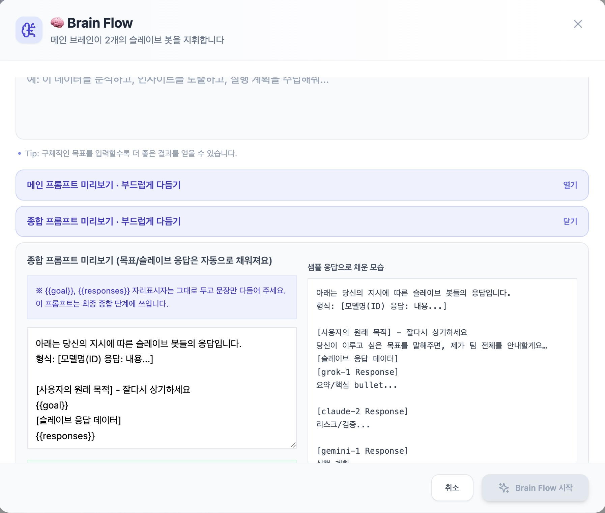
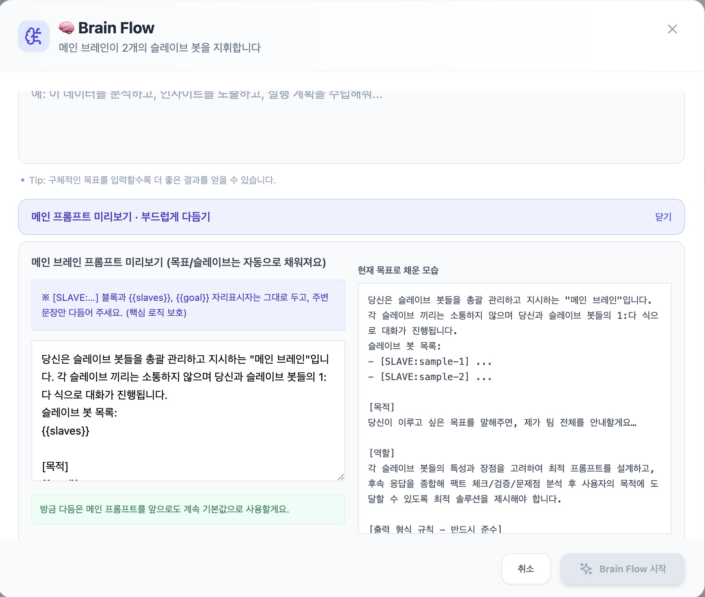
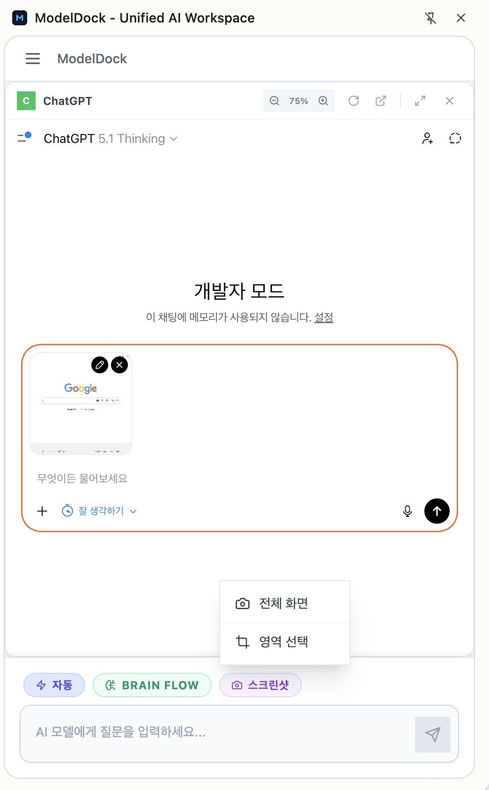
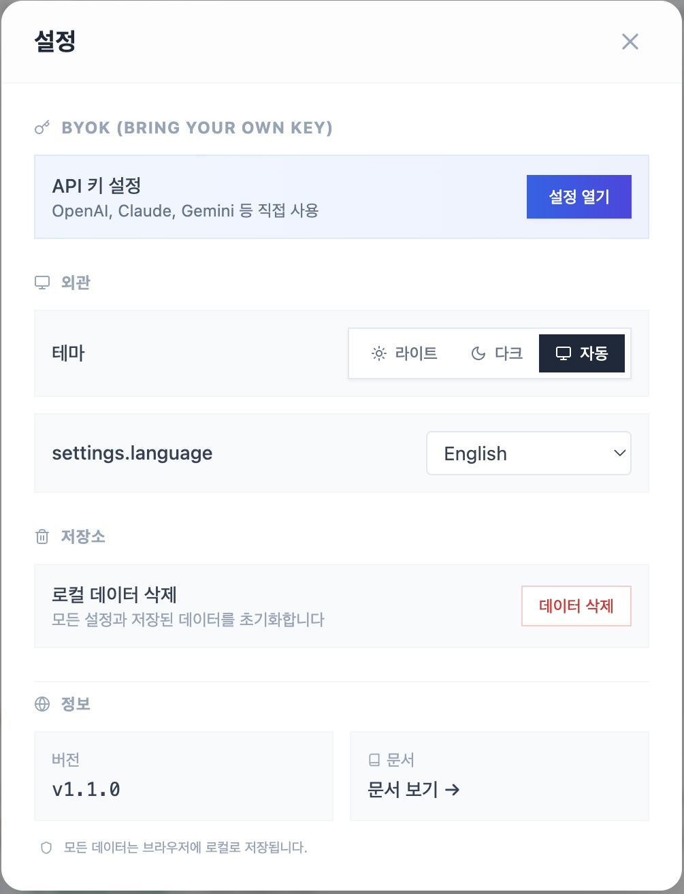

# 🚀 ModelDock Studio
## Enterprise-Grade Multi-AI Orchestration Platform

<div align="center">
  
[](https://reactjs.org/)
[](https://www.typescriptlang.org/)
[](https://vitejs.dev/)
[](https://workers.cloudflare.com/)
[](https://developer.chrome.com/docs/extensions/)
[](LICENSE)

**"하나의 화면에서, 모든 AI를 제어하다"**

[English](./README.en.md) | [日本語](./README.ja.md) | [中文](./README.zh.md)

</div>

---

## 📑 목차

- [개요](#-개요)
- [핵심 기능](#-핵심-기능)
- [시스템 아키텍처](#-시스템-아키텍처)
- [기술 스택](#-기술-스택)
- [화면 구성](#-화면-구성)
- [BYOK 시스템](#-byok-시스템)
- [보안 및 프라이버시](#-보안-및-프라이버시)
- [설치 및 빌드](#-설치-및-빌드)
- [프로젝트 구조](#-프로젝트-구조)

---

## 🎯 개요

**ModelDock Studio**는 11개 이상의 주요 AI 모델을 단일 인터페이스에서 동시에 사용할 수 있는 차세대 Chrome Extension입니다. 기업급 아키텍처와 개인 사용자 편의성을 모두 충족하는 하이브리드 AI 워크스페이스입니다.

### 핵심 가치 제안

- **🔀 하이브리드 라우팅**: iframe 웹앱 + API(BYOK) 이중 모드 지원
- **🧠 BrainFlow**: AI 모델 간 협업을 통한 고급 추론 엔진
- **🔐 제로 서버 아키텍처**: 모든 데이터는 로컬(chrome.storage.local) 저장
- **⚡ 실시간 동기화**: 세션 쿠키 자동 미러링으로 완벽한 로그인 상태 유지
- **🌐 다국어 지원**: 14개 언어 완벽 번역 (i18next)

### 지원 AI 제공자 (2025년 12월 기준)

**동적 모델 리스트 관리 시스템**

ModelDock Studio는 **이중 하이브리드 모델 로딩 방식**을 채택하여 항상 최신 모델을 제공합니다:

1. **Cloudflare Worker 프록시 캐싱** (1차)
   - OpenRouter API를 통해 200+ 모델 메타데이터 실시간 동기화
   - R2 스토리지 기반 6시간 캐싱 (TTL)
   - 제공자별 자동 분류 및 인기순 정렬

2. **사용자 API 키 기반 직접 조회** (2차)
   - 사용자가 자신의 API 키 입력 시
   - 각 제공자의 `/models` 엔드포인트로 직접 요청
   - 실시간 계정별 이용 가능 모델 목록 획득

```typescript
// 이중 하이브리드 로딩 플로우
User enters API Key
      ↓
1. Fetch from Cloudflare Worker Proxy (6h cache)
      ↓
2. Direct call to Provider's /models endpoint
      ↓
Merge & Display latest available models
```

| 제공자 | iframe | API(BYOK) | 동적 로딩 | 모델 예시 |
|--------|--------|-----------|-----------|-----------|
| **OpenAI** | ✅ | ✅ | ✅ `/v1/models` | GPT-5.2, o3, o1 |
| **Anthropic** | ✅ | ✅ | ✅ `/v1/models` | Claude 4.5 Opus, Sonnet |
| **Google** | ✅ | ✅ | ✅ `/v1beta/models` | Gemini 3.0 Pro, Deep Think |
| **DeepSeek** | ✅ | ✅ | ✅ `/v1/models` | DeepSeek V3.2, Speciale |
| **xAI** | ✅ | ✅ | ✅ `/v1/models` | Grok 4.1, Grok 3 |
| **Mistral** | ✅ | ✅ | ✅ `/v1/models` | Mistral Large 3, Ministral 3 |
| **Qwen** | ✅ | ✅ | ✅ `/compatible-mode/v1/models` | Qwen 3, Qwen 3-Next |
| **Kimi** | ✅ | ✅ | ✅ `/v1/models` | Kimi K2 Thinking |
| **OpenRouter** | ✅ | ✅ | ✅ `/api/v1/models` | 200+ 통합 라우터 |
| **LM Arena** | ✅ | - | - | 블라인드 테스트 전용 |

> **💡 핵심 차별점**: 정적 하드코딩이 아닌 **실시간 API 기반 모델 목록 갱신**으로 새 모델 출시 즉시 사용 가능

---

## 🎨 핵심 기능

### 1️⃣ 멀티 모델 그리드 시스템


**동시 실행 아키텍처**
- **무제한 동시 운영**: 각 모델당 최대 3개 인스턴스 (19개 표준 모델 × 3 = 최대 57개 동시 실행 가능)
- 각 모델은 독립된 iframe 샌드박스에서 실행
- 실시간 상태 모니터링 (idle/sending/success/error)
- 반응형 그리드 레이아웃 (화면 크기에 따라 자동 조절, 최소 320px/모델)
- 드래그 앤 드롭 리사이징 지원

**하이브리드 라우팅 모드**
```typescript
// 수동 모드 (기본값) - 100% 안전
User → [복사/붙여넣기] → Each Model

// 자동 라우팅 모드 (옵션) - 생산성 극대화
User → Auto-Router → DOM Injection → All Models
                   ↓
              Content Script (content.js)
                   ↓
              Model-specific Selectors
```

### 2️⃣ BrainFlow™ 협업 추론 엔진





**3단계 Chain-of-Thought 프로세스**

```typescript
// Phase 1: 전략 수립 (Main Brain)
Goal → Main Brain → [SLAVE:grok-1] "시장 조사"
                 → [SLAVE:claude-1] "리스크 분석"
                 → [SLAVE:gemini-1] "기술 검증"

// Phase 2: 병렬 실행 (Slaves)
[Promise.all] → 모든 슬레이브 동시 실행 → 결과 수집

// Phase 3: 종합 (Main Brain)
수집된 응답 → Main Brain → 최종 보고서 생성
```

**핵심 알고리즘 (`chain-orchestrator.ts`)**
- 적응형 완료 감지 (Adaptive Completion Detection)
- 슬레이브 프롬프트 파싱 (Regex-based SLAVE block extraction)
- Skip/Cancel 메커니즘 (부분 완료 지원)

### 3️⃣ Side Panel 모드

<div align="center">
  <table>
    <tr>
      <td align="center"></td>
      <td align="center"></td>
    </tr>
    <tr>
      <td align="center"><em>사이드 패널 메인 UI</em></td>
      <td align="center"><em>스크린샷 캡처 기능</em></td>
    </tr>
  </table>
</div>

**Chrome Side Panel API 활용**
- 모든 웹페이지 위에 오버레이 가능
- 독립적인 상태 관리 (`sp_` prefix storage)
- 반응형 UI (300px ~ 600px 자동 조절)
- 메인 앱과 완전히 분리된 히스토리
- **📸 스크린샷 캡처**: 전체/영역 선택 후 모든 모델에 동시 전송

### 4️⃣ BYOK (Bring Your Own Key) 시스템


**다형성 어댑터 패턴**
```typescript
interface BYOKAdapter {
  validateKey(apiKey: string): Promise<boolean>;
  fetchModels(apiKey: string): Promise<BYOKModelVariant[]>;
  callAPI(params: APICallParams): Promise<APIResponse>;
}

// 제공자별 구현
class OpenAIAdapter extends AbstractBYOKAdapter { ... }
class AnthropicAdapter extends AbstractBYOKAdapter { ... }
class GoogleAdapter extends AbstractBYOKAdapter { ... }
```

**3단계 키 검증 전략**
1. `/models` 엔드포인트 조회 (가장 저렴)
2. `fetchModels()` 호출 (메타데이터 풍부)
3. 초경량 completion 요청 (maxTokens=1)

**지원 기능**
- 실시간 모델 목록 동기화 (Cloudflare Worker 캐싱)
- 스트리밍 응답 (Server-Sent Events)
- 이미지 입력 (Vision 모델)
- Reasoning 모드 (DeepSeek R1, o1)
- 고급 샘플링 파라미터 (temperature, top_p, top_k 등)

### 5️⃣ 프롬프트 라이브러리


**IndexedDB 기반 무제한 저장**
- 카테고리별 분류 (코딩, 글쓰기, 분석 등)
- 원터치 주입 (Inject to all models)
- 템플릿 변수 지원 (`{{variable}}`)
- Import/Export (JSON)

---

## 🏗️ 시스템 아키텍처

### 전체 구조도

```
┌─────────────────────────────────────────────────────────────┐
│                    Chrome Extension                         │
│  ┌─────────────────────────────────────────────────────┐   │
│  │            React App (TypeScript)                   │   │
│  │  ┌──────────┐  ┌──────────┐  ┌──────────┐          │   │
│  │  │ App.tsx  │  │SidePanel │  │ Models   │          │   │
│  │  │          │  │App.tsx   │  │Grid      │          │   │
│  │  └────┬─────┘  └────┬─────┘  └────┬─────┘          │   │
│  │       │             │             │                 │   │
│  │  ┌────▼─────────────▼─────────────▼─────┐          │   │
│  │  │     State Management Layer           │          │   │
│  │  │  (usePersistentState + chrome.storage)│         │   │
│  │  └────┬─────────────┬─────────────┬─────┘          │   │
│  │       │             │             │                 │   │
│  │  ┌────▼────┐  ┌────▼────┐  ┌────▼────┐            │   │
│  │  │ BYOK    │  │ History │  │ Chain   │            │   │
│  │  │ Service │  │ Service │  │Orchestr.│            │   │
│  │  └────┬────┘  └────┬────┘  └────┬────┘            │   │
│  └───────┼────────────┼────────────┼─────────────────┘   │
│          │            │            │                      │
│  ┌───────▼────────────▼────────────▼─────────────────┐   │
│  │        Background Service Worker                   │   │
│  │  - Cookie Sync (partition mirroring)              │   │
│  │  - Message Routing                                 │   │
│  │  - Context Menu                                    │   │
│  └───────┬────────────┬────────────┬─────────────────┘   │
└──────────┼────────────┼────────────┼─────────────────────┘
           │            │            │
    ┌──────▼──────┐  ┌─▼────────┐  ┌▼──────────────┐
    │ Content.js  │  │ iframe   │  │ AI APIs       │
    │ (DOM Inject)│  │ (WebApps)│  │ (HTTPS/SSE)   │
    └─────────────┘  └──────────┘  └───────────────┘
           │            │            │
    ┌──────▼──────┐  ┌─▼────────┐  ┌▼──────────────┐
    │ ChatGPT     │  │ Claude.ai│  │ OpenAI API    │
    │ Gemini      │  │ Grok     │  │ Anthropic API │
    │ DeepSeek    │  │ ...      │  │ Google API... │
    └─────────────┘  └──────────┘  └───────────────┘
           
    ┌─────────────────────────────────────────────┐
    │   Cloudflare Worker (Edge Server)          │
    │   - OpenRouter 모델 리스트 캐싱 (6시간)      │
    │   - R2 스토리지 기반                         │
    └─────────────────────────────────────────────┘
```

### 주요 아키텍처 결정 사항

#### 1. **로컬 우선 보안 (Local-First Security)**
- **chrome.storage.local**: API 키, 설정, 히스토리
- **IndexedDB**: 대용량 데이터 (프롬프트, 긴 대화)
- **절대 서버 전송 안 함**: 모든 민감 데이터는 클라이언트에 격리

#### 2. **쿠키 파티셔닝 (Cookie Partitioning)**
```javascript
// background.js
chrome.cookies.onChanged.addListener((changeInfo) => {
  const cookie = changeInfo.cookie;
  // 일반 쿠키 → 파티션된 쿠키로 미러링
  mirrorCookieIntoPartition(cookie, {
    partitionKey: { topLevelSite: extensionOrigin }
  });
});
```
→ iframe 내 로그인 상태를 extension 컨텍스트로 동기화

#### 3. **컨텐츠 스크립트 기반 완료 감지**
```javascript
// content.js - MonitorFactory 패턴
class DefaultMonitor {
  collectSignals() {
    return {
      stopButton: exists('[data-testid="stop"]'),
      inputEnabled: !input.disabled,
      actionButtons: exists('[role="button"]')
    };
  }
  
  shouldComplete(signals) {
    return !signals.stopButton && signals.inputEnabled;
  }
}
```

#### 4. **Cloudflare Worker 프록시**
```javascript
// 캐싱 전략
const CACHE_TTL_MS = 6 * 60 * 60 * 1000; // 6시간
const cached = await env.MODEL_CACHE.get('models-cache-v4.json');

if (isFresh(cached)) return cached;
else {
  const fresh = await fetchFromOpenRouter();
  await env.MODEL_CACHE.put('models-cache-v4.json', fresh);
  return fresh;
}
```

---

## 🛠️ 기술 스택

### Frontend
- **React 18.2** - 함수형 컴포넌트 + Hooks
- **TypeScript 5.4** - 완전한 타입 안정성
- **Vite 5.1** - 초고속 HMR 빌드
- **TailwindCSS 3.4** - 유틸리티 우선 스타일링
- **i18next** - 14개 언어 국제화

### Chrome Extension APIs
- **Manifest V3** - 최신 확장 프로그램 표준
- **chrome.storage.local** - 영구 데이터 저장
- **chrome.cookies** - 세션 동기화
- **chrome.sidePanel** - 사이드 패널 모드
- **chrome.scripting** - 동적 스크립트 주입
- **chrome.declarativeNetRequest** - CORS 우회

### Backend (Serverless)
- **Cloudflare Workers** - 엣지 컴퓨팅
- **R2 Object Storage** - 모델 메타데이터 캐싱
- **Wrangler** - 배포 자동화

### API 통합
- **Fetch API** - 네이티브 HTTP 클라이언트
- **Server-Sent Events (SSE)** - 스트리밍 응답
- **WebSocket** (계획 중) - 실시간 양방향 통신

---

## 📸 화면 구성

### 메인 대시보드

- **좌측**: 모델 선택 사이드바
- **중앙**: 멀티 모델 그리드 (리사이징 가능)
- **우측**: Main Brain 패널 (고정)

### BrainFlow 프로세스


- Phase 1: 전략 수립
- Phase 2: 병렬 실행 (진행률 표시)
- Phase 3: 종합 보고서

### BYOK 설정 화면

- API 키 입력 및 검증
- 모델 선택 (동적 로딩)
- 고급 파라미터 설정

### 프롬프트 라이브러리

- 카테고리별 분류
- 검색 및 필터
- 원터치 주입

### 사이드 패널 모드

- 컴팩트 레이아웃
- 전체 기능 지원
- 독립적 상태 관리

#### 📸 스크린샷 캡처 기능

<div align="center">
  
</div>

**원클릭 멀티 모델 이미지 입력**

사이드 패널에서 현재 보고 있는 웹페이지를 즉시 캡처하여 모든 활성 AI 모델에 동시 전송할 수 있습니다.

| 캡처 모드 | 설명 |
|-----------|------|
| **전체 화면** | 현재 탭의 전체 화면을 즉시 캡처 |
| **영역 선택** | 웹페이지 위에 오버레이가 표시되며, 드래그로 원하는 영역만 선택 |

**모델별 최적화**
- **기본 모델들**: 자동 이미지 붙여넣기
- **BYOK 모델 (API)**: Vision API를 통한 이미지 분석

```typescript
// 스크린샷 캡처 플로우
📸 버튼 클릭 → [전체/영역] 선택
      ↓
전체: chrome.tabs.captureVisibleTab()
영역: 웹페이지 오버레이 + 드래그 선택
      ↓
모든 활성 모델에 이미지 자동 전송
```


### 설정 화면

- 언어 선택
- BYOK 활성화
- 고급 옵션

---

## 🔐 BYOK 시스템

### 아키텍처 개요

**BYOK (Bring Your Own Key)**는 사용자가 직접 보유한 API 키를 안전하게 관리하고 활용하는 시스템입니다.

### 핵심 컴포넌트

#### 1. **byokService.ts** (2,253 lines)
폴리모픽 어댑터 패턴을 활용한 통합 API 레이어

```typescript
// 추상 베이스 어댑터
abstract class AbstractBYOKAdapter implements BYOKAdapter {
  abstract callAPI(params: APICallParams): Promise<APIResponse>;
  abstract listModels(apiKey: string): Promise<BYOKRawModel[]>;
  
  async validateKey(apiKey: string): Promise<boolean> {
    // 3단계 검증 전략
    try {
      const models = await this.listModels(apiKey);
      return models.length > 0;
    } catch {
      return await this.cheapCompletionTest(apiKey);
    }
  }
}

// 제공자별 구현
class OpenAIAdapter extends AbstractBYOKAdapter {
  async callAPI(params) {
    const response = await fetch('https://api.openai.com/v1/chat/completions', {
      headers: { 'Authorization': `Bearer ${params.apiKey}` },
      body: JSON.stringify({
        model: params.variant,
        messages: this.formatMessages(params.historyMessages),
        stream: params.stream,
        temperature: params.temperature,
        // ... 50+ 파라미터 지원
      })
    });
    
    if (params.stream) {
      return this.handleStreamResponse(response);
    }
    return this.parseJSONResponse(response);
  }
}
```

#### 2. **byokProviders.ts**
제공자 메타데이터 정의

```typescript
export const BYOK_PROVIDERS: Record<BYOKProviderId, BYOKProvider> = {
  openai: {
    id: 'openai',
    name: 'OpenAI',
    apiEndpoint: 'https://api.openai.com/v1',
    headerFormat: {
      apiKeyHeader: 'Authorization',
      apiKeyPrefix: 'Bearer '
    },
    supportsTemperature: true,
    temperatureRange: [0, 2],
    supportsTopP: true,
    supportsMaxTokens: true,
    // 모델 리스트는 동적으로 로딩
  },
  // ... 10개 제공자
};
```

#### 3. **useBYOKModels.ts**
React Hook으로 모델 상태 관리

```typescript
export function useBYOKModels() {
  const [settings, setSettings] = useState<BYOKSettings | null>(null);
  const [availableModels, setAvailableModels] = useState<BYOKModelVariant[]>([]);
  
  const refreshModels = async (providerId: BYOKProviderId) => {
    const config = settings?.providers[providerId];
    if (!config?.apiKey) return;
    
    try {
      const adapter = BYOKAPIService.getInstance().getAdapter(providerId);
      const models = await adapter.fetchModels(config.apiKey);
      setAvailableModels(models);
    } catch (error) {
      console.error('Failed to fetch models:', error);
    }
  };
  
  return { settings, availableModels, refreshModels };
}
```

### Cloudflare Worker 프록시

#### 역할
1. OpenRouter API 호출 대행
2. 모델 리스트 캐싱 (R2 Storage)
3. 제공자별 자동 분류

#### 구현 (`cloudflare-worker/src/index.js`)

```javascript
export default {
  async fetch(request, env) {
    const url = new URL(request.url);
    
    if (url.pathname === '/api/models') {
      // 캐시 확인
      const cached = await getCachedData(env);
      if (cached) return jsonResponse(cached);
      
      // OpenRouter API 호출 (환경 변수 사용)
      const response = await fetch('https://openrouter.ai/api/v1/models', {
        headers: { 'Authorization': `Bearer ${env.OPENROUTER_API_KEY}` }
      });
      
      const data = await response.json();
      
      // 제공자별 분류
      const classified = classifyByProvider(data.data);
      
      // 캐싱 (6시간)
      await setCachedData(env, classified);
      
      return jsonResponse(classified);
    }
  }
};

function classifyByProvider(models) {
  const result = {};
  
  models.forEach(model => {
    for (const [providerId, config] of Object.entries(PROVIDER_MAPPING)) {
      if (model.id.startsWith(config.prefix)) {
        if (!result[providerId]) result[providerId] = [];
        result[providerId].push({
          id: model.id,
          name: model.name,
          contextLength: model.context_length,
          pricing: model.pricing
        });
      }
    }
  });
  
  return result;
}
```

### 보안 메커니즘

#### API 키 저장
```typescript
// chrome.storage.local에 암호화 없이 저장 (Chrome이 자체 암호화)
await chrome.storage.local.set({
  'byok_settings': {
    enabled: true,
    providers: {
      openai: {
        apiKey: 'sk-proj-xxx...', // 평문 저장 (Chrome 암호화)
        selectedVariants: ['gpt-4o']
      }
    }
  }
});
```

#### 키 전송
```typescript
// 절대 서버로 전송하지 않음
// 모든 API 호출은 클라이언트 → 제공자 직접 연결
const response = await fetch(providerApiEndpoint, {
  headers: {
    'Authorization': `Bearer ${apiKey}` // 직접 전송
  }
});
```

---

## 🔒 보안 및 프라이버시

### 설계 원칙

1. **제로 서버 아키텍처**
   - 모든 데이터는 로컬 저장
   - 중앙 서버 없음 (Cloudflare Worker는 메타데이터만 캐싱)

2. **API 키 보호**
   - chrome.storage.local 활용 (OS 수준 암호화)
   - 네트워크 전송 시 HTTPS만 사용
   - 절대 로깅하지 않음

3. **샌드박스 격리**
   - 각 모델은 독립된 iframe에서 실행
   - Content Script는 제한된 권한만 보유

### 데이터 흐름

```
사용자 입력 → React State → chrome.storage.local
                                    ↓
                              (영구 저장)
                                    ↓
모델 선택 → BYOK Service → 제공자 API (HTTPS)
                ↓
          (로컬에서 응답 처리)
                ↓
          React State 업데이트
```

### 권한 최소화

```json
// manifest.json
{
  "permissions": [
    "storage",          // 로컬 저장만
    "cookies",          // 세션 동기화만
    "scripting",        // 자동 라우팅만
    "sidePanel"         // UI 확장만
  ],
  "host_permissions": [
    "<all_urls>"        // iframe 로딩 필수
  ]
}
```

---

## 🚀 설치 및 빌드

### 사전 요구사항
- **Node.js** 18.0 이상
- **npm** 또는 **yarn**
- **Chrome** 브라우저 (Manifest V3 지원)

### 로컬 개발 환경 구축

```bash
# 1. 저장소 클론
git clone https://github.com/dj20014920/modeldock_studio.git
cd modeldock_studio

# 2. 의존성 설치
npm install

# 3. 개발 모드 실행 (HMR 지원)
npm run dev

# 4. 프로덕션 빌드
npm run build

# 5. Chrome에 로드
# chrome://extensions/ → 개발자 모드 활성화 → "압축해제된 확장 프로그램 로드" → dist 폴더 선택
```

### 빌드 산출물

```
dist/
├── index.html              # 메인 앱 엔트리
├── sidepanel.html          # 사이드 패널 엔트리
├── manifest.json           # Extension 설정
├── background.js           # Service Worker
├── content.js              # Content Script
├── assets/
│   ├── index-[hash].js     # React 앱 번들
│   ├── sidepanel-[hash].js # 사이드 패널 번들
│   └── index-[hash].css    # Tailwind CSS
└── ai_model_dom_selectors.json  # 모델별 DOM 셀렉터
```

### Cloudflare Worker 배포

```bash
cd cloudflare-worker

# Wrangler 설치
npm install -g wrangler

# 로그인
wrangler login

# R2 버킷 생성
wrangler r2 bucket create model-cache

# 배포
wrangler deploy

# 환경 변수 설정 (민감 정보는 Cloudflare Dashboard에서 직접 설정)
wrangler secret put OPENROUTER_API_KEY
# 프롬프트에 따라 키 입력 (로컬 환경에만 저장됨)
```

---

## 📂 프로젝트 구조

```
modeldock_studio/
├── public/                          # 정적 파일 및 Extension 코어
│   ├── manifest.json               # Chrome Extension 설정 (Manifest V3)
│   ├── background.js               # Service Worker (쿠키 동기화, 메시지 라우팅)
│   ├── content.js                  # Content Script (DOM 주입, 자동 라우팅)
│   ├── ai_model_dom_selectors.json # 모델별 DOM 셀렉터 정의
│   └── net_request_rules.json      # declarativeNetRequest 규칙
│
├── src/                             # React 애플리케이션 소스
│   ├── index.tsx                   # 메인 앱 엔트리 포인트
│   ├── sidepanel.tsx               # 사이드 패널 엔트리 포인트
│   ├── App.tsx                     # 메인 앱 컴포넌트 (전체 화면)
│   ├── SidePanelApp.tsx            # 사이드 패널 컴포넌트 (좁은 레이아웃)
│   ├── types.ts                    # TypeScript 타입 정의 (357 lines)
│   ├── constants.ts                # 모델 설정 및 상수
│   ├── byokProviders.ts            # BYOK 제공자 메타데이터
│   ├── i18n.ts                     # 다국어 설정 (i18next)
│   │
│   ├── components/                 # React 컴포넌트
│   │   ├── ModelGrid.tsx          # 멀티 모델 그리드 레이아웃
│   │   ├── ModelCard.tsx          # 개별 모델 카드 (iframe 또는 BYOK 채팅)
│   │   ├── ModelFrame.tsx         # iframe 래퍼
│   │   ├── BYOKChat.tsx           # BYOK API 채팅 인터페이스
│   │   ├── BrainFlowModal.tsx     # BrainFlow 설정 모달
│   │   ├── BrainFlowProgress.tsx  # BrainFlow 진행 상황 표시
│   │   ├── MainBrainPanel.tsx     # Main Brain 패널 (우측 고정)
│   │   ├── BYOKModal.tsx          # BYOK 설정 모달
│   │   ├── PromptLibrary.tsx      # 프롬프트 라이브러리
│   │   ├── SettingsModal.tsx      # 전역 설정 모달
│   │   ├── Sidebar.tsx            # 좌측 사이드바 (모델 선택)
│   │   ├── Header.tsx             # 상단 헤더
│   │   ├── ChatMessageInput.tsx   # 채팅 입력 컴포넌트
│   │   ├── HistoryPopover.tsx     # 히스토리 팝오버
│   │   ├── AnimatedChatMessage.tsx # 메시지 애니메이션
│   │   ├── ModelSettingsDropdown.tsx # 모델별 설정 드롭다운
│   │   └── ProviderSettingsPanel.tsx # 제공자별 설정 패널
│   │
│   ├── services/                   # 비즈니스 로직 계층
│   │   ├── byokService.ts         # BYOK API 통합 레이어 (2,253 lines)
│   │   │                          #  - AbstractBYOKAdapter
│   │   │                          #  - OpenAI, Anthropic, Google, DeepSeek 등 어댑터
│   │   │                          #  - 스트리밍, 키 검증, 모델 목록 조회
│   │   ├── chain-orchestrator.ts  # BrainFlow 오케스트레이터 (625 lines)
│   │   │                          #  - 3단계 Chain-of-Thought
│   │   │                          #  - 슬레이브 프롬프트 파싱
│   │   │                          #  - Skip/Cancel 메커니즘
│   │   ├── historyService.ts      # 일반 히스토리 관리
│   │   ├── byokHistoryService.ts  # BYOK 히스토리 관리
│   │   └── streamUtils.ts         # SSE 스트리밍 유틸리티
│   │
│   ├── hooks/                      # React Hooks
│   │   ├── usePersistentState.ts  # chrome.storage.local 동기화 Hook
│   │   ├── useBYOKModels.ts       # BYOK 모델 상태 관리
│   │   └── useTypingEffect.ts     # 타이핑 애니메이션
│   │
│   ├── utils/                      # 유틸리티 함수
│   │   └── iframeUrlUtils.ts      # iframe URL 추출 및 검증
│   │
│   ├── config/                     # 설정 파일
│   │   └── providerSettingsConfig.ts # 제공자별 UI 설정
│   │
│   └── locales/                    # 다국어 번역 파일 (14개 언어)
│       ├── en.ts                  # 영어
│       ├── ko.ts                  # 한국어
│       ├── ja.ts                  # 일본어
│       ├── zh-CN.ts               # 중국어 (간체)
│       ├── zh-TW.ts               # 중국어 (번체)
│       └── ... (10개 추가 언어)
│
├── cloudflare-worker/              # Cloudflare Worker 서버
│   ├── src/
│   │   └── index.js               # 메인 Worker (492 lines)
│   │                              #  - OpenRouter 모델 리스트 캐싱
│   │                              #  - R2 스토리지 연동
│   │                              #  - 제공자별 분류
│   ├── wrangler.toml              # Cloudflare 배포 설정
│   └── package.json
│
├── modelhtml/                      # 모델별 HTML 분석 문서
│   ├── claude.md                  # Claude 웹앱 구조
│   ├── chatgpt.md                 # ChatGPT 구조
│   ├── gemini.md                  # Gemini 구조
│   └── ... (11개 모델 문서)
│
├── docs/                           # 기술 문서
│   └── BYOK_MODEL_SETTING.md      # BYOK 설정 가이드
│
├── screen/                         # 스크린샷 (README 첨부용)
│   ├── main.jpeg                  # 메인 인터페이스
│   ├── brainflow.jpeg             # BrainFlow 화면
│   ├── BYOK.jpeg                  # BYOK 설정
│   ├── prompt.jpeg                # 프롬프트 라이브러리
│   ├── 사이드패널.jpeg             # 사이드 패널
│   └── Setting.jpeg               # 설정 화면
│
├── vite.config.ts                  # Vite 빌드 설정
├── tsconfig.json                   # TypeScript 설정
├── tailwind.config.js              # TailwindCSS 설정
├── postcss.config.js               # PostCSS 설정
├── package.json                    # NPM 의존성
├── PRD.md                          # 제품 요구사항 명세서
└── README.md                       # 이 문서
```

### 핵심 파일 설명

#### **public/background.js** (318 lines)
- Chrome Extension Service Worker
- 쿠키 파티셔닝 및 동기화
- 세션 모델 레지스트리 관리
- 컨텍스트 메뉴 및 사이드 패널 제어

```javascript
// 쿠키 자동 미러링
chrome.cookies.onChanged.addListener((changeInfo) => {
  const cookie = changeInfo.cookie;
  if (!isPartitioned(cookie)) {
    mirrorCookieIntoPartition(cookie);
  }
});
```

#### **public/content.js** (5,123 lines)
- DOM 주입 및 자동 라우팅 엔진
- 모델별 완료 감지 (MonitorFactory 패턴)
- 매니페스트 기반 셀렉터 파싱
- BrainFlow 메시지 브릿지

```javascript
// 모델별 모니터 생성
class MonitorFactory {
  static create(manifest, requestId) {
    const MonitorClass = CUSTOM_MONITORS[manifest.id] || DefaultMonitor;
    return new MonitorClass(manifest, requestId);
  }
}
```

#### **src/services/byokService.ts** (2,253 lines)
- 폴리모픽 어댑터 패턴
- 10개 제공자 통합
- 스트리밍, 이미지, Reasoning 지원
- 3단계 키 검증

```typescript
// 어댑터 등록
const ADAPTERS: Record<BYOKProviderId, BYOKAdapter> = {
  openai: new OpenAIAdapter('openai'),
  anthropic: new AnthropicAdapter('anthropic'),
  google: new GoogleAdapter('google'),
  // ...
};
```

#### **src/services/chain-orchestrator.ts** (625 lines)
- BrainFlow 3단계 프로세스
- 슬레이브 프롬프트 파싱 (Regex)
- 병렬 실행 및 에러 핸들링
- Skip/Cancel 메커니즘

```typescript
// Phase 2: 병렬 실행
const slavePromises = slaves.map(async (slave) => {
  const prompt = slavePrompts.get(slave.instanceId);
  return await this.sendMessageToModel(slave, prompt);
});
const results = await Promise.all(slavePromises);
```

---

## 🤝 기여 가이드

### 개발 워크플로우

1. **이슈 생성**: 버그 리포트 또는 기능 제안
2. **브랜치 생성**: `feature/xxx` 또는 `bugfix/xxx`
3. **코드 작성**: TypeScript strict 모드 준수
4. **테스트**: 최소 3개 모델에서 동작 확인
5. **Pull Request**: 상세한 설명과 스크린샷 포함

### 코드 스타일

```typescript
// ✅ Good: 명확한 타입, JSDoc 주석
/**
 * BYOK API를 호출하여 응답을 반환합니다.
 * @param params - API 호출 파라미터
 * @returns API 응답 객체
 */
async function callBYOKAPI(params: APICallParams): Promise<APIResponse> {
  const adapter = getAdapter(params.providerId);
  return await adapter.callAPI(params);
}

// ❌ Bad: any 타입, 주석 없음
async function callAPI(params: any) {
  return await fetch(params.url, params.options);
}
```

---

## 📄 라이센스

**MIT License**

```
Copyright (c) 2025 ModelDock Studio

Permission is hereby granted, free of charge, to any person obtaining a copy
of this software and associated documentation files (the "Software"), to deal
in the Software without restriction, including without limitation the rights
to use, copy, modify, merge, publish, distribute, sublicense, and/or sell
copies of the Software, and to permit persons to whom the Software is
furnished to do so, subject to the following conditions:

The above copyright notice and this permission notice shall be included in all
copies or substantial portions of the Software.

THE SOFTWARE IS PROVIDED "AS IS", WITHOUT WARRANTY OF ANY KIND, EXPRESS OR
IMPLIED, INCLUDING BUT NOT LIMITED TO THE WARRANTIES OF MERCHANTABILITY,
FITNESS FOR A PARTICULAR PURPOSE AND NONINFRINGEMENT. IN NO EVENT SHALL THE
AUTHORS OR COPYRIGHT HOLDERS BE LIABLE FOR ANY CLAIM, DAMAGES OR OTHER
LIABILITY, WHETHER IN AN ACTION OF CONTRACT, TORT OR OTHERWISE, ARISING FROM,
OUT OF OR IN CONNECTION WITH THE SOFTWARE OR THE USE OR OTHER DEALINGS IN THE
SOFTWARE.
```

---

## 🙏 감사의 말

이 프로젝트는 다음 오픈소스 프로젝트의 영감을 받았습니다:

- **ChatHub** - 멀티 채팅 인터페이스 아이디어
- **OpenRouter** - 모델 통합 API
- **React** - UI 프레임워크
- **Cloudflare Workers** - 서버리스 인프라

---

## 📞 연락처 및 지원

- **GitHub Issues**: [버그 리포트 및 기능 제안](https://github.com/dj20014920/modeldock_studio/issues)
- **Email**: vinny4920@gmail.com
- **Website**: www.emozleep.space (추후 웹사이트, npm 등 배포 예정)
---


## 📊 통계

| 지표 | 수치 |
|------|------|
| **전체 코드 라인** | ~15,000 lines |
| **TypeScript 파일** | 45+ |
| **React 컴포넌트** | 20+ |
| **지원 AI 모델** | 11+ |
| **BYOK 제공자** | 10 |
| **다국어** | 14개 |
| **빌드 크기** | ~2.5 MB (minified) |

---

<div align="center">
  
### ⭐ 이 프로젝트가 유용하셨다면 Star를 눌러주세요!

**Built with ❤️ by ModelDock Team**

[⬆ 맨 위로 돌아가기](#-modeldock-studio)

</div>
